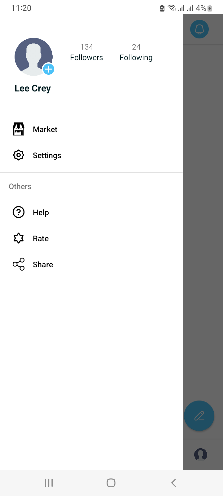
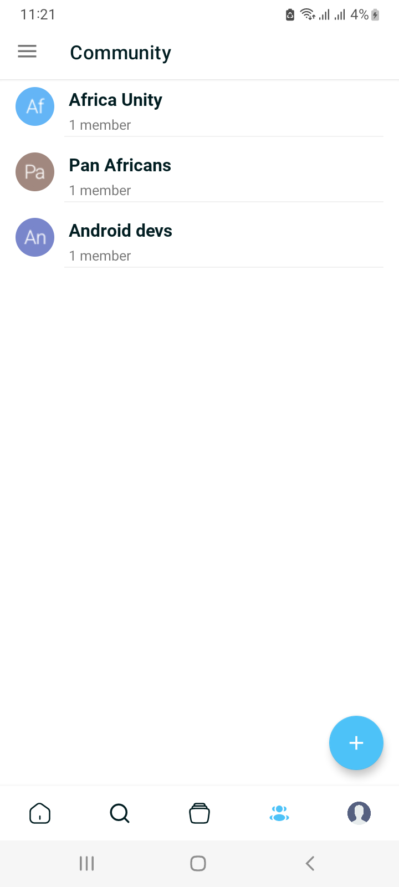
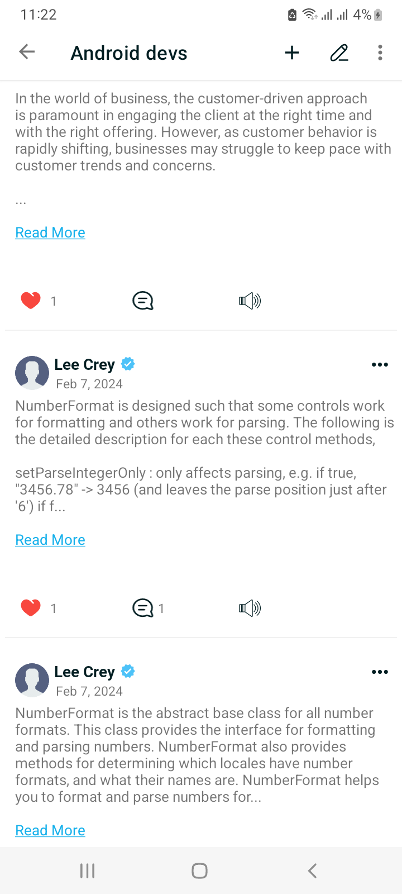
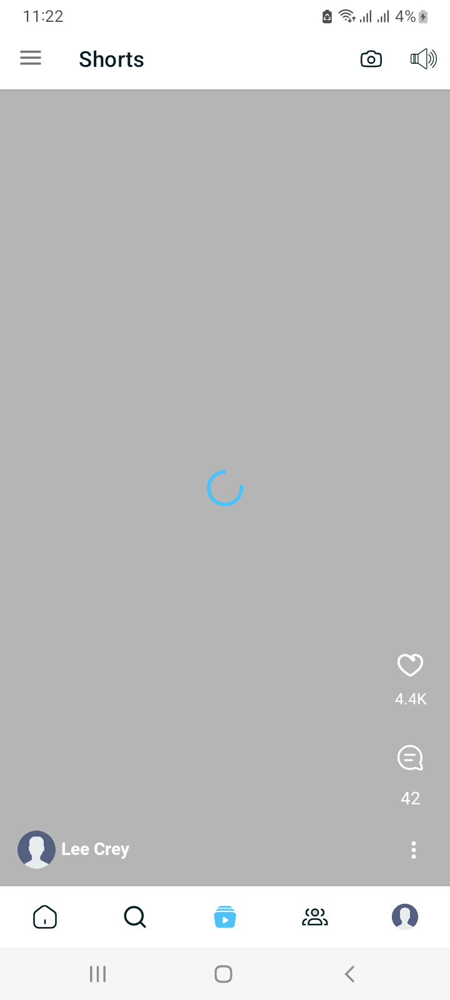
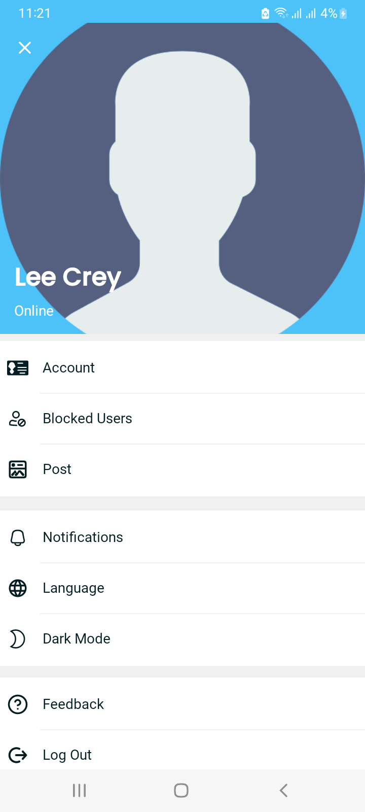

# Sefer

Mini Social application.

## Screenshots

You can get the build app [here](./images/sefer)

## Features

* follow/unfollow
* posts, comments, replies
* block, unblock
* Like(Vote) posts, comments, and replies
* Swipeable video(like Youtube shorts, Tiktok)

## Techs
* Coroutine
* Retrofit
* Credentials Manager
* Push Notifications(Firebase)
* Media 3(for video play)
* Markwon(for markdown)

## Missing Features
* Chatting(the ui is designed)
* Stories

**Contributions are always welcome**

## 2024 Solomon B.(Lee Crey)
